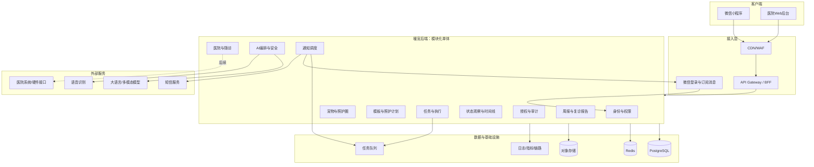
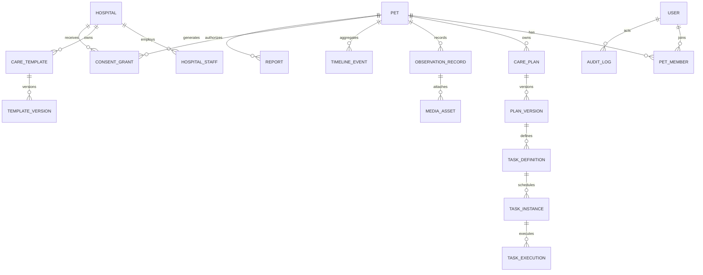
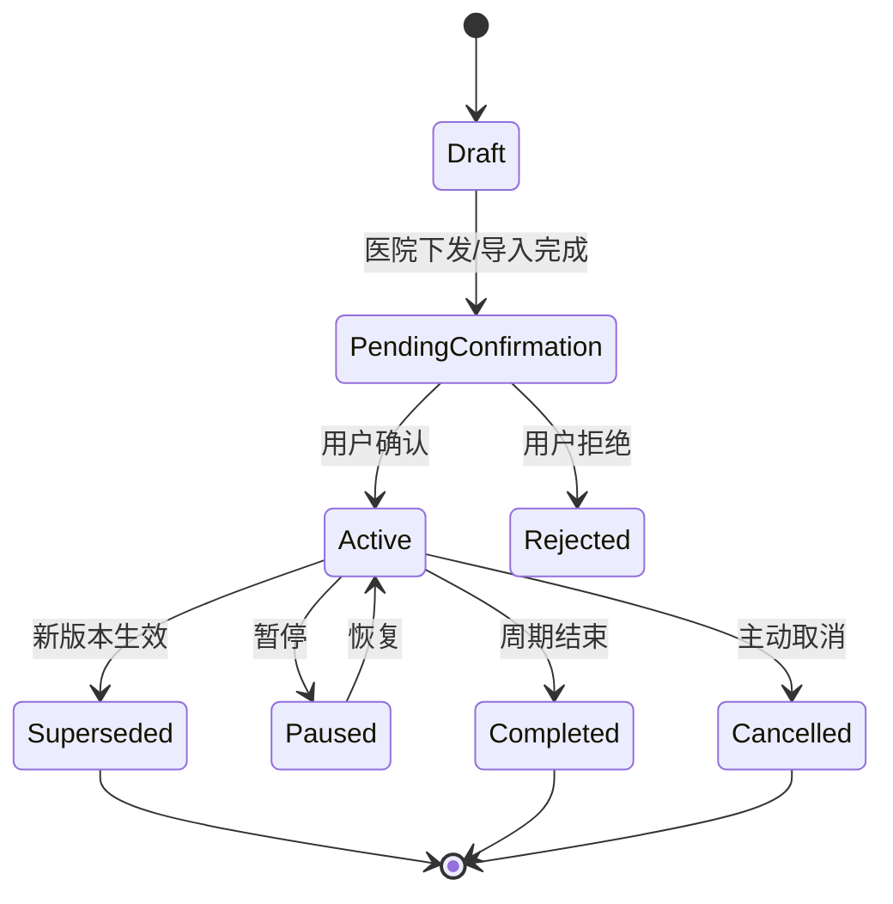
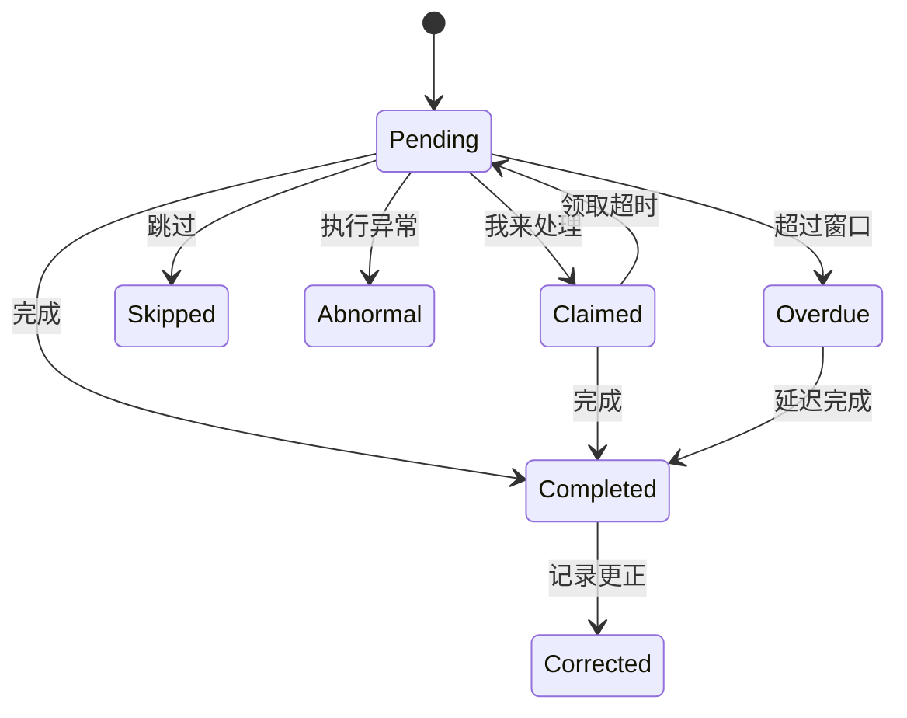
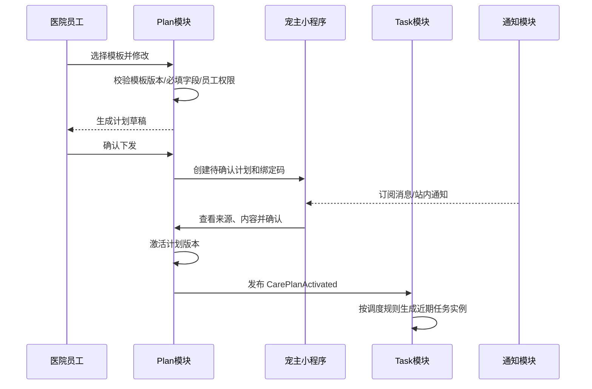
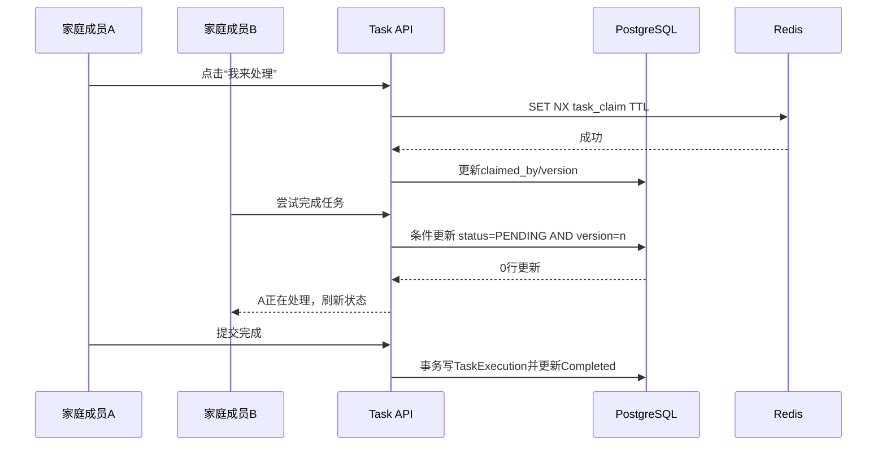
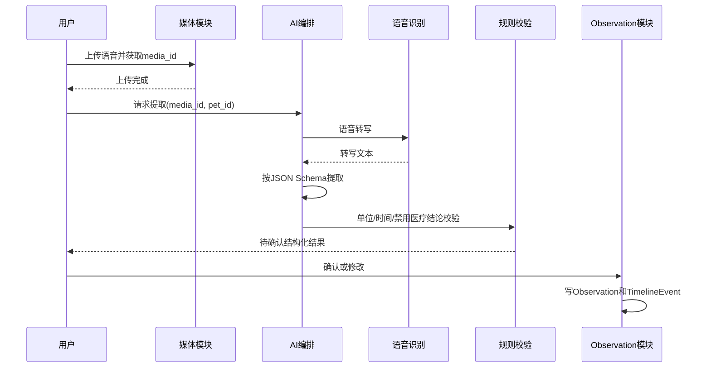

# 暖宠技术逻辑方案

## 1. 文档信息

| 项目 | 内容 |
| --- | --- |
| 文档名称 | 暖宠技术逻辑方案 |
| 文档版本 | V1.0 |
| 对应产品文档 | 暖宠宠物连续照护平台 PRD V3.0 |
| 目标阶段 | MVP验证、首阶段研发及后续扩展基线 |
| 目标读者 | 产品、前端、后端、AI、测试、运维、安全、兽医顾问 |
| 核心终端 | 宠主微信小程序、医院Web后台 |

---

## 2. 目标、假设与非目标

### 2.1 技术目标

1. 支撑“照护计划—任务执行—状态记录—时间线—AI摘要—医院复诊”的完整闭环；
2. 在多病种下复用同一套照护领域模型，通过模板配置差异；
3. 确保用药执行、家庭协作和计划版本具备可追溯性；
4. 将生成式AI限制在结构化、整理和表达层，医疗判断由规则、专业模板和人工确认控制；
5. 满足用户授权、医院多租户、敏感数据隔离和审计要求；
6. 保持MVP实现简单，同时为医院系统、硬件和多模态能力预留扩展点。

### 2.2 关键工程假设

- MVP阶段并发规模不高，业务复杂度高于流量复杂度；
- 微信小程序是宠主主入口，医院后台是B端入口；
- 医院不承担默认实时监控责任，系统主要提供异步随访和复诊信息；
- 医院创建的计划必须经人工确认，AI不能直接下发医疗计划；
- 用户上传的语音、图片和视频属于敏感数据，需要私有存储和受控访问；
- 初期不依赖医院HIS/PIMS深度集成，可通过二维码、链接和人工录入工作；
- 初期不训练自有医学模型，使用可替换的语音、多模态及大语言模型服务。

### 2.3 技术非目标

- 不建设在线首诊、处方开具和远程诊疗系统；
- 不建设完整医院HIS/PIMS；
- 不实现AI疾病诊断或自动调整药物剂量；
- 不在MVP阶段拆分为大量微服务；
- 不实现全量智能硬件协议；
- 不构建实时视频监控和全天候医院告警中心；
- 不建设商城、保险交易和社区系统。

---

## 3. 总体技术原则

### 3.1 模块化单体优先

MVP采用模块化单体架构，而不是微服务。所有业务模块位于同一后端应用，但通过明确模块边界、领域事件和独立数据访问层解耦。

原因：

- 当前核心风险是需求与工作流，不是系统吞吐；
- 计划、任务、记录、授权和AI结果存在强事务关联；
- 单体部署、测试和观测成本更低；
- 后续可按负载和团队边界拆分AI、通知、报告和媒体模块。

### 3.2 确定性逻辑与生成式AI分离

- 任务生成、用药防重复、权限、趋势统计、紧急规则必须使用确定性代码；
- AI只负责非结构化内容提取、文本整理和自然语言摘要；
- 所有AI输出先经过结构校验、业务规则校验和安全过滤；
- 医疗相关AI结果必须能够回溯原始记录。

### 3.3 所有关键变化可追溯

照护计划版本、药物剂量、任务执行、记录修正、医院访问、授权撤销及AI生成结果均需保留审计记录。

### 3.4 用户确认优先

语音、OCR和多模态识别结果不直接进入正式医疗相关时间线，必须由用户或医院成员确认。

### 3.5 配置适配病种

疾病差异通过模板、指标定义、提醒规则和任务参数配置，不为每个病种复制代码流程。

---

## 4. 总体架构



### 4.1 客户端

#### 宠主端

推荐使用微信小程序，支持微信授权登录、订阅消息、二维码绑定医院和家庭分享。

#### 医院端

推荐使用响应式Web后台，主要适配桌面浏览器，护士或客服可在平板上使用。

### 4.2 接入层

- 统一HTTPS；
- WAF、限流、请求签名和IP风控；
- 小程序与医院端使用不同BFF视图，但复用领域服务；
- API使用版本前缀，例如 `/api/v1`；
- 所有写请求携带幂等键或业务版本号。

### 4.3 应用层

应用层按领域模块组织，不允许跨模块直接读写对方表。跨模块协作优先使用领域服务和事务内事件。

### 4.4 数据层

- PostgreSQL：关系数据、事务和审计；
- Redis：短期锁、幂等键、缓存和限流；
- 对象存储：图片、语音、视频、报告文件；
- 队列：通知、报告生成、AI任务和周期性任务；
- 可观测平台：结构化日志、错误追踪、指标和告警。

---

## 5. 推荐技术栈

### 5.1 前端

| 场景 | 建议 |
| --- | --- |
| 微信小程序 | Taro + React + TypeScript，或团队熟悉时采用原生小程序 |
| 医院后台 | React + TypeScript + Vite + Ant Design |
| 数据请求 | TanStack Query，统一错误和缓存策略 |
| 表单 | React Hook Form + Schema校验 |
| 图表 | ECharts，避免前端自行计算医疗趋势 |

选择Taro的前提是团队已有React经验；若只发布微信且重视首屏性能，可直接使用原生小程序。

### 5.2 后端

| 能力 | 建议 |
| --- | --- |
| 应用框架 | NestJS + TypeScript |
| API | REST/OpenAPI，内部异步采用领域事件 |
| ORM | Prisma或TypeORM，统一迁移脚本 |
| 数据库 | PostgreSQL 16+ |
| 缓存/锁 | Redis |
| 队列 | BullMQ/Redis；规模扩大后可切换云队列 |
| 文件 | 阿里云OSS、腾讯云COS或同等私有对象存储 |
| 身份认证 | 微信OpenID/UnionID + 医院账号OIDC/JWT |

### 5.3 AI服务

MVP可由后端AI模块直接编排模型API。达到以下任一条件后拆为独立Python/FastAPI服务：

- 需要复杂多模型路由；
- 需要批量向量或时序特征计算；
- 需要独立扩缩容；
- AI团队与业务后端由不同团队维护。

模型调用必须通过Provider Adapter，业务代码不得绑定单一厂商。适配接口至少包括：

```text
transcribeAudio()
extractObservation()
summarizeTimeline()
generateFollowupQuestions()
analyzeImageMetadata()
```

### 5.4 部署

- Docker容器化；
- MVP使用托管容器或单集群Kubernetes均可，优先选团队熟悉方案；
- 数据库、Redis和对象存储使用云托管服务；
- 国内用户数据优先部署在中国境内区域；
- 区分开发、测试、预发布和生产环境；
- 密钥存储在Secrets Manager，不进入代码和镜像。

---

## 6. 领域模块边界

| 模块 | 核心职责 |
| --- | --- |
| Identity | 用户、登录会话、设备和基础身份 |
| Organization | 医院租户、部门、员工和角色 |
| Pet | 宠物档案、主人关系和照护圈 |
| Template | 病种模板、指标定义、适用范围和审核版本 |
| CarePlan | 计划实例、版本、来源、状态和计划变更 |
| Task | 任务定义、任务实例、完成、跳过和异常 |
| Observation | 状态记录、测量值、媒体和用户确认 |
| Timeline | 汇聚各模块事实事件，提供查询视图 |
| Collaboration | 我来处理、临时权限和防重复操作 |
| HospitalCare | 患者绑定、随访问卷、工作队列和复诊 |
| Consent | 数据授权、授权范围、撤销和访问判定 |
| AIOrchestrator | 语音/多模态提取、摘要、安全校验和模型版本 |
| Report | 周报、复诊摘要、只读分享和PDF |
| Notification | 订阅消息、短信、站内信和重试 |
| Audit | 关键操作、访问记录和合规导出 |

---

## 7. 核心领域模型

### 7.1 实体关系概览



### 7.2 关键实体

#### User

```text
id, wechat_open_id, union_id, mobile, display_name,
status, created_at, last_login_at
```

手机号、OpenID等标识单独加密或脱敏展示。用户注销采用业务删除和法定保留策略组合。

#### Pet

```text
id, owner_user_id, name, species, breed, sex,
birth_date, weight, health_stage, status,
primary_hospital_id, created_at, updated_at
```

`health_stage`用于产品展示，不作为医疗诊断字段。

#### PetMember

```text
id, pet_id, user_id, role, permission_set,
invited_by, valid_from, valid_until, status
```

角色建议：OWNER、FAMILY、TEMP_CARER、VIEWER。实际权限由permission_set决定，避免只靠角色硬编码。

#### CareTemplate / TemplateVersion

```text
template_id, hospital_id, category, disease_tag,
version, content_schema, applicable_conditions,
contraindications, reviewer_id, review_status,
published_at, retired_at
```

模板发布后不可原地修改，只能创建新版本。旧计划继续引用创建时版本。

#### CarePlan / PlanVersion

```text
care_plan_id, pet_id, source_type, source_org_id,
current_version_id, status, start_at, end_at,
created_by, confirmed_by_user_at

plan_version_id, version_no, template_version_id,
plan_payload, change_reason, created_by, created_at
```

来源类型：USER、HOSPITAL、IMPORT_ASSISTED。AI/OCR只能生成草稿，不能作为正式来源。

#### TaskDefinition

```text
id, plan_version_id, task_type, title,
schedule_rule, valid_window, payload,
priority, completion_schema, reminder_policy
```

`payload`按task_type使用不同JSON Schema，例如药物任务包含药名、剂量、单位和给药方式。

#### TaskInstance

```text
id, task_definition_id, pet_id, scheduled_at,
window_start, window_end, status, claimed_by,
claim_expires_at, version, generated_key
```

`generated_key`由任务定义、宠物和计划时间生成唯一键，防止调度器重复创建。

#### TaskExecution

```text
id, task_instance_id, executor_user_id,
action, actual_at, result_payload,
note, created_at, supersedes_execution_id
```

任务执行记录采用追加写，不覆盖历史；更正通过supersedes关联。

#### ObservationRecord

```text
id, pet_id, definition_key, observed_at,
value_type, value_number, value_text, value_enum,
unit, source_type, confidence, confirmed_by,
raw_content_id, created_by, created_at
```

必须明确区分NORMAL、ABNORMAL和NOT_RECORDED，不能用空值代表正常。

#### TimelineEvent

```text
id, pet_id, occurred_at, event_type,
source_module, source_id, summary,
visibility, correction_status
```

时间线是查询投影，不是所有业务事实的唯一存储。事实仍保存在各领域表中。

#### ConsentGrant

```text
id, pet_id, grantor_user_id, grantee_org_id,
scope, data_types, start_at, end_at,
status, revoked_at, created_at
```

权限判断必须实时检查授权状态，不能仅依赖发放时生成的长期Token。

#### AIArtifact

```text
id, pet_id, artifact_type, input_refs,
model_provider, model_name, prompt_version,
schema_version, raw_output, validated_output,
safety_result, user_correction, status, created_at
```

#### Report

```text
id, pet_id, report_type, period_start, period_end,
snapshot_version, content, evidence_refs,
generated_at, share_token_hash, expires_at
```

### 7.3 推荐索引

- `task_instance(pet_id, scheduled_at, status)`；
- `task_instance(task_definition_id, generated_key)`唯一索引；
- `observation_record(pet_id, definition_key, observed_at)`；
- `timeline_event(pet_id, occurred_at desc)`；
- `consent_grant(pet_id, grantee_org_id, status, end_at)`；
- `audit_log(org_id, created_at)`和`audit_log(subject_type, subject_id)`；
- 医院租户表的所有核心索引包含`organization_id`。

---

## 8. 核心状态机

### 8.1 照护计划



医院修改已生效计划时创建新版本。若修改涉及药物剂量、频率或停药时间，必须要求用户重新确认，并向所有具备用药权限的协作者发送通知。

### 8.2 任务实例



### 8.3 AI提取结果

```text
QUEUED → PROCESSING → NEEDS_CONFIRMATION → CONFIRMED
                  ↘ FAILED / SAFETY_BLOCKED / EXPIRED
```

只有CONFIRMED状态可以生成正式ObservationRecord和TimelineEvent。

---

## 9. 核心业务流程

### 9.1 医院下发照护计划



关键规则：

- 医院员工必须属于计划来源医院并具备PLAN_WRITE权限；
- 计划确认页显示医院、员工、模板版本和更新时间；
- 模板与计划内容均保存快照，不能只保存外键；
- 用户拒绝计划时不产生正式任务；
- 任务生成采用唯一键和幂等消费。

### 9.2 多人防重复用药



防重复不能只依赖前端按钮状态，后端必须使用条件更新、版本号和唯一执行规则。允许管理员更正，但不能物理删除执行记录。

### 9.3 语音快速记录



### 9.4 周报与复诊摘要

1. 报告服务按时间范围查询任务执行、观察记录、计划变更和就诊事件；
2. 趋势引擎使用确定性SQL/代码计算完成率、频次、分布、中位数和环比；
3. 生成Evidence Bundle，包含每个结论的记录ID；
4. LLM仅将结构化事实转换为自然语言；
5. 安全层检查诊断、因果、药物建议和夸大表达；
6. 保存报告快照和证据引用；
7. 用户确认后分享，医院仅在授权范围内查看。

### 9.5 授权医院查看

每次读取执行：

```text
员工身份有效
AND 员工属于目标医院
AND 员工具有目标资源权限
AND ConsentGrant处于ACTIVE
AND 当前时间在授权窗口内
AND 数据类型位于scope中
```

查看报告、下载文件和打开媒体都写入审计日志。

---

## 10. AI技术逻辑

### 10.1 AI链路分层

```text
原始输入层
→ 语音转写/OCR/媒体元数据
→ 结构化提取
→ Schema校验
→ 业务规则与医疗安全校验
→ 用户确认
→ 正式记录
→ 确定性趋势计算
→ 证据包
→ 自然语言摘要
→ 输出安全校验
```

### 10.2 结构化提取Schema示例

```json
{
  "observed_at": "2026-06-21T20:00:00+08:00",
  "observations": [
    {
      "definition_key": "appetite_ratio",
      "value_number": 0.7,
      "unit": "ratio",
      "source_quote": "今天大概吃了七成",
      "confidence": 0.94
    },
    {
      "definition_key": "cough_count",
      "value_number": 3,
      "unit": "count",
      "period": "night",
      "source_quote": "晚上咳了三次",
      "confidence": 0.97
    }
  ],
  "task_claims": [
    {
      "task_type": "medication",
      "status": "user_claimed_completed",
      "source_quote": "药已经喂了",
      "requires_task_match": true
    }
  ],
  "medical_conclusions": []
}
```

“药已经喂了”不能直接完成任意任务。系统必须展示匹配到的待完成任务，由用户确认具体药物后再执行。

### 10.3 Prompt设计原则

系统提示应要求模型：

- 只提取用户明确表达的信息；
- 不补全疾病、原因、剂量或未表达的时间；
- 无法确定时返回`null`并要求确认；
- 每项结构化结果保留原文证据；
- 输出严格JSON，禁止Markdown和额外解释；
- 不输出诊断、处方、停药或紧急程度结论。

Prompt、Schema、安全规则和模型版本分别版本化。任何生产变更必须经过离线评测集和灰度发布。

### 10.4 趋势引擎

趋势计算不交给LLM。首期支持：

- 任务完成率、漏服次数、延迟分布；
- 事件频次按日/周聚合；
- 数值指标的中位数、最小值、最大值和变化比例；
- 当前窗口与上一等长窗口比较；
- 记录完整度和缺失天数；
- 计划变更前后时间窗口对齐；
- 好日子/坏日子及喜欢活动完成情况。

输出示例：

```json
{
  "metric": "cough_days",
  "current": {"from": "2026-06-15", "to": "2026-06-21", "value": 4},
  "previous": {"from": "2026-06-08", "to": "2026-06-14", "value": 1},
  "evidence_record_ids": ["obs_1", "obs_2", "obs_3", "obs_4"]
}
```

### 10.5 安全分层

1. **输入层**：文件类型、大小、恶意内容和隐私检查；
2. **提取层**：严格Schema、字段白名单、置信度阈值；
3. **规则层**：单位范围、时间合理性、药物任务匹配；
4. **医疗层**：禁用诊断、因果和用药建议；
5. **输出层**：敏感词和承诺式文案检查；
6. **人工层**：用户确认、医院计划人工确认、兽医模板审核。

### 10.6 明确紧急场景

呼吸困难、持续抽搐、失去意识、大量出血等明确场景由兽医审核的规则词典和结构化输入触发统一提示。提示只建议尽快联系兽医或前往医院，不判断疾病和严重等级。

医院端不得自动显示为“医院已接警”。只有员工主动领取或医院另行购买带SLA的服务时，才能展示处理状态。

### 10.7 AI评测指标

- 字段级Precision/Recall/F1；
- 时间、单位和频次解析准确率；
- 虚构字段率；
- 医疗越界率；
- 用户修正率；
- 摘要事实一致率；
- 证据引用完整率；
- 单次调用成本和P95时延。

---

## 11. API设计

### 11.1 API约定

- REST + JSON；
- 时间统一使用ISO 8601并带时区；
- 金额使用最小货币单位；
- 数值指标同时携带unit；
- 写请求支持`Idempotency-Key`；
- 更新请求支持`version`或`If-Match`；
- 错误结构包含`code`、`message`、`request_id`和可选字段错误。

### 11.2 核心接口

```text
POST   /api/v1/auth/wechat/login
GET    /api/v1/me

POST   /api/v1/pets
GET    /api/v1/pets/{petId}
POST   /api/v1/pets/{petId}/members/invitations
PATCH  /api/v1/pets/{petId}/members/{memberId}

POST   /api/v1/care-plans
POST   /api/v1/care-plans/{id}/versions
POST   /api/v1/care-plans/{id}/confirm
POST   /api/v1/care-plans/{id}/pause

GET    /api/v1/pets/{petId}/tasks?date=YYYY-MM-DD
POST   /api/v1/tasks/{id}/claim
POST   /api/v1/tasks/{id}/complete
POST   /api/v1/tasks/{id}/skip
POST   /api/v1/tasks/{id}/correct

POST   /api/v1/media/upload-tickets
POST   /api/v1/ai/extractions
GET    /api/v1/ai/extractions/{id}
POST   /api/v1/ai/extractions/{id}/confirm

POST   /api/v1/pets/{petId}/observations
GET    /api/v1/pets/{petId}/timeline
GET    /api/v1/pets/{petId}/trends

POST   /api/v1/pets/{petId}/reports
GET    /api/v1/reports/{id}
POST   /api/v1/reports/{id}/share-links

POST   /api/v1/consents
GET    /api/v1/consents
POST   /api/v1/consents/{id}/revoke

POST   /api/v1/hospitals/{id}/patient-invitations
GET    /api/v1/hospitals/{id}/patients
GET    /api/v1/hospitals/{id}/followup-queue
POST   /api/v1/followups
```

### 11.3 领域事件

```text
CarePlanActivated
CarePlanVersionChanged
TaskInstanceGenerated
TaskClaimed
TaskCompleted
TaskExecutionCorrected
ObservationConfirmed
ObservationCorrected
ConsentGranted
ConsentRevoked
ReportGenerated
FollowupRequested
NotificationRequested
```

事件包含`event_id`、`occurred_at`、`actor`、`aggregate_id`、`aggregate_version`和`trace_id`。消费者记录已处理event_id，保证幂等。

---

## 12. 通知与调度

### 12.1 任务生成

- 计划激活时预生成未来7天任务；
- 每日滚动补齐未来任务；
- 计划变更时取消未开始的旧版本任务并生成新任务；
- 已完成任务不回滚，保留版本来源；
- 时区以宠物主要照护时区为准。

### 12.2 通知策略

- 提前提醒、到点提醒、逾期提醒分开配置；
- 同一任务设置去重窗口；
- 多人照护默认不向所有人无限重复推送；
- 订阅消息不可用时降级为站内待办，关键场景可选短信；
- 每次发送记录模板、目标、结果和重试次数。

### 12.3 重试与死信

- 网络类失败指数退避；
- 业务类失败不自动重试；
- 达到最大次数进入死信队列；
- 运维后台支持查看、重放和忽略；
- 重放仍使用业务幂等键。

---

## 13. 多租户、权限与数据安全

### 13.1 租户模型

医院是Organization租户。所有医院数据必须带`organization_id`，仓储层默认注入租户过滤条件，禁止由前端传入任意租户ID绕过。

家庭数据以Pet为资源边界，通过PetMember和ConsentGrant授权。医院不是宠物数据的默认所有者。

### 13.2 RBAC + ABAC

- RBAC控制医院员工角色：ADMIN、VET、NURSE、CUSTOMER_SERVICE、READ_ONLY；
- ABAC检查医院、宠物、授权范围、数据类型、时间窗口和资源来源；
- 高风险操作需要二次验证和更高权限；
- 临时照护者权限自动过期。

### 13.3 数据分类

| 等级 | 示例 | 控制 |
| --- | --- | --- |
| L1公开 | 产品帮助、模板公开说明 | 常规访问 |
| L2内部 | 运营配置、非敏感统计 | 员工权限 |
| L3敏感 | 宠物照护记录、医院患者关系 | 加密、授权、审计 |
| L4高敏感 | 手机号、OpenID、精确位置、原始媒体 | 字段加密、最小访问、严格审计 |

### 13.4 安全控制

- TLS 1.2+；
- 数据库和对象存储静态加密；
- 对象存储默认私有，使用短期签名URL；
- 生产日志不记录Token、手机号和原始病情文本；
- 敏感字段脱敏展示；
- 登录、授权、下载和媒体访问进行风控；
- 管理后台开启MFA；
- 定期权限回收和密钥轮换；
- 数据导出和删除采用异步任务并记录审计。

### 13.5 数据保留

保留期限必须由法务、医院合同和产品策略确认。建议区分：

- 账户数据；
- 家庭照护记录；
- 医院依法/依约保存的医疗记录；
- 原始媒体；
- AI中间结果；
- 审计日志和安全日志。

用户撤销医院授权不等于删除医院依法保留的记录，两者必须在产品文案和数据模型中区分。

---

## 14. 非功能需求

### 14.1 性能目标

| 场景 | 目标 |
| --- | --- |
| 今日任务查询 | P95 < 500ms |
| 任务完成提交 | P95 < 800ms |
| 时间线首屏 | P95 < 800ms |
| 普通后台列表 | P95 < 1s |
| AI结构化 | P95 < 12s，异步可轮询 |
| 周报生成 | 2分钟内完成 |

### 14.2 可用性与恢复

- MVP月可用性目标99.5%，商业化后99.9%；
- PostgreSQL每日全量备份并持续增量备份；
- 建议RPO不超过15分钟，RTO不超过4小时；
- 对象存储开启版本控制或回收站；
- 定期执行恢复演练，而不是只检查备份任务成功。

### 14.3 可观测性

- 每个请求生成request_id和trace_id；
- 关键业务指标、技术指标和安全指标分开监控；
- 监控任务生成失败、通知积压、AI失败率、报告延迟、授权拒绝和异常登录；
- 告警必须包含影响范围、关联版本和处理手册链接。

### 14.4 无障碍与适老化

- 字号和点击区域满足移动端可用性；
- 不只用颜色表达任务状态；
- 重要用药信息避免过小文本；
- 支持家庭成员代操作，但明确操作人；
- 错误提示说明如何恢复，而非仅显示失败。

---

## 15. 医院系统与硬件集成

### 15.1 MVP阶段

- 医院通过后台人工创建或套用模板；
- 使用二维码/邀请链接绑定宠物；
- 检查报告由用户或医院上传；
- 不依赖医院现有系统即可完成闭环。

### 15.2 标准集成层

后续建立Integration Adapter：

```text
HospitalAdapter
  - importPatient()
  - importVisit()
  - importPrescriptionDraft()
  - pushFollowupSummary()

DeviceAdapter
  - syncActivity()
  - syncWeight()
  - syncFeeding()
  - syncLitterEvent()
```

所有外部数据必须记录provider、external_id、采集时间和同步时间。外部系统更新采用upsert与版本检查，不能覆盖用户手工修正而无留痕。

### 15.3 OCR导入

OCR只生成草稿：

```text
上传处方/出院说明
→ OCR文本
→ AI提取候选药物与任务
→ 单位和剂量规则检查
→ 医院员工或用户逐项确认
→ 创建正式计划草稿
```

药物名称相似、单位缺失、手写不清和剂量超出配置范围时必须阻断自动确认。

---

## 16. 测试策略

### 16.1 单元测试

重点覆盖：

- 调度规则和跨日时区；
- 任务幂等生成；
- 计划版本切换；
- 多人并发完成任务；
- 授权范围判断；
- 趋势计算；
- 紧急规则和禁用AI输出；
- 数据更正和审计。

### 16.2 集成测试

- PostgreSQL事务与唯一约束；
- Redis锁失效和重入；
- 队列重试与死信；
- 对象存储签名URL；
- 微信登录和订阅消息；
- 模型Provider超时、限流和降级。

### 16.3 端到端测试

至少覆盖：

1. 医院下发计划—用户确认—任务生成；
2. 家庭成员领取—另一成员被阻止重复执行；
3. 语音记录—AI提取—用户修正—时间线生成；
4. 授权医院—查看报告—撤销授权—再次访问被拒绝；
5. 计划改剂量—用户重新确认—新任务生效；
6. 周报生成—证据引用—分享链接过期。

### 16.4 AI离线评测集

建立脱敏且经授权的固定评测集，包含：

- 正常语音、口语、省略和方言样本；
- 时间模糊、单位缺失和多药物样本；
- 正常状态、异常状态和未记录区分；
- 容易诱发诊断或因果推断的样本；
- 紧急词、否定词和历史描述；
- 恶意Prompt注入和无关内容。

模型或Prompt升级必须达到既定阈值，且医疗越界率不能回退。

### 16.5 安全测试

- 越权访问和租户穿透；
- IDOR对象直接引用；
- 分享链接枚举；
- 文件上传类型伪造；
- Token重放和会话撤销；
- 敏感信息日志泄露；
- 依赖漏洞和容器镜像扫描。

---

## 17. 建议代码结构

```text
warm-pet/
  apps/
    miniapp/                 # 微信小程序
    hospital-web/            # 医院后台
    api/                     # NestJS模块化单体
  packages/
    api-contracts/           # OpenAPI生成类型/Schema
    domain-types/            # 共享领域枚举和值对象
    ui/                      # Web共享UI，不强行复用小程序组件
    observability/           # 日志、指标和追踪
  services/
    ai-worker/               # 达到拆分条件后启用
  infra/
    docker/
    migrations/
    deployment/
  docs/
    architecture/
    api/
    security/
    runbooks/
```

后端模块示例：

```text
apps/api/src/modules/
  identity/
  organization/
  pet/
  template/
  care-plan/
  task/
  observation/
  timeline/
  collaboration/
  hospital-care/
  consent/
  ai-orchestrator/
  report/
  notification/
  audit/
```

---

## 18. 分阶段技术实施

### 阶段0：两周Concierge验证

目标不是写完整系统，而是验证数据结构和流程。

- Figma或轻量H5模拟宠主流程；
- 表单/小程序原型采集每日记录；
- 人工审核AI结构化结果；
- 由兽医评估复诊摘要；
- 固化第一版Observation Schema和报告结构。

交付物：流程原型、脱敏样本、AI评测集、数据字典和验证结论。

### 阶段1：MVP核心闭环，建议8—10周

#### Sprint 1：基础设施与身份

- 项目骨架、CI/CD和环境；
- 微信登录、医院账号和RBAC；
- 宠物档案和照护圈；
- 基础审计和对象存储。

#### Sprint 2：计划和任务

- 模板、计划版本和用户确认；
- 任务调度、完成、跳过和更正；
- 多人领取、防重复和提醒。

#### Sprint 3：状态与时间线

- 状态定义和记录；
- 媒体上传；
- 时间线投影；
- 基础趋势计算。

#### Sprint 4：AI与报告

- 语音转写和结构化提取；
- 用户确认；
- 周报和复诊摘要；
- 证据回溯和安全过滤。

#### Sprint 5：医院闭环与试点

- 患者邀请、执行概览和随访队列；
- 授权、撤销和访问审计；
- 试点数据埋点、性能和安全加固。

### 阶段2：产品验证后

- OCR导入；
- 医院自定义模板；
- 生活质量和照护负担；
- 更丰富的多模态输入；
- 运营指标和计费；
- 基础PIMS/硬件适配。

### 阶段3：规模化

- 将AI Worker、通知和报告按负载拆分；
- 事件总线切换为托管消息队列；
- 多区域容灾和更严格SLO；
- 标准化医院接口、设备接口和数据治理；
- 经授权的匿名化研究数据管道。

---

## 19. 团队与角色建议

### MVP研发团队

| 角色 | 建议人数 | 主要职责 |
| --- | ---: | --- |
| 产品负责人 | 1 | 需求、试点、指标和医疗边界 |
| 技术负责人/后端 | 1 | 架构、领域模型、安全和代码质量 |
| 后端工程师 | 1—2 | 业务模块、任务、报告和集成 |
| 小程序工程师 | 1 | 宠主端体验和微信能力 |
| Web前端工程师 | 1 | 医院后台 |
| AI工程师 | 1 | 提取、评测、Prompt和安全链路 |
| 测试工程师 | 1 | E2E、回归、并发和安全测试 |
| 设计师 | 0.5—1 | 小程序、医院后台和可用性 |
| 兽医顾问 | 0.5 | 模板、紧急规则和输出审核 |

小团队可由技术负责人兼后端、设计师兼职，但AI评测和兽医审核不可省略。

---

## 20. 工程验收标准

首阶段上线前至少满足：

1. 医院计划具备来源、版本和用户确认记录；
2. 任务生成具备幂等性，计划变更不会产生重复任务；
3. 两名家庭成员并发操作不会重复完成同一用药任务；
4. AI提取未经确认不会写入正式时间线；
5. 所有摘要结论均能跳转原始证据；
6. 趋势数值由确定性代码生成，而非LLM计算；
7. 撤销医院授权后，医院无法读取新增或超范围数据；
8. 分享链接可过期、撤销且不可枚举；
9. 关键操作和医院访问完整写入审计日志；
10. 紧急提示不承诺医院已接收或实时处理；
11. 核心E2E流程自动化通过；
12. 数据备份恢复演练成功；
13. AI医疗越界评测达到上线阈值；
14. 生产日志不存在Token和原始敏感内容；
15. 关键指标和告警可在监控面板查看。

---

## 21. 上线前待确认事项

1. 首批云区域、数据保留期及隐私条款；
2. 微信订阅消息可用模板和触达限制；
3. 医院员工角色、服务时间和响应责任文案；
4. 首批模板的专业审核人和版本发布流程；
5. 紧急规则的适用范围及法律审查；
6. AI模型供应商、境内数据处理和降级策略；
7. C端与医院端的计费、退款和合同边界；
8. 用户注销、数据导出、删除和医院记录保留关系；
9. 试点医院是否需要品牌定制；
10. AI输入是否允许用于模型改进，默认建议不允许，除非另行明确授权。

---

## 22. 技术结论

暖宠的核心技术难点不是搭建普通提醒应用，而是同时保证：

- 多病种计划可以配置而不复制业务；
- 用药和多人协作具有事务一致性；
- 连续记录可以被计算、追溯和纠正；
- AI降低输入和整理成本但不越过医疗边界；
- 家庭数据在明确授权下安全地流向医院；
- 医院获得价值但不被默认绑定实时响应责任。

因此首阶段应采用模块化单体、关系数据库、确定性任务与趋势引擎，以及受Schema和规则约束的AI编排。先完成一个可靠、可审计的连续照护闭环，再依据真实负载和组织边界拆分服务，是风险最低且最符合当前产品阶段的工程路径。
